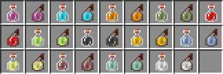

## Glintless Potions
Backports the "glintless" look of potions in later versions (1.19+).

---

### Image

### Installation
1. Download [Glintless Potions](https://github.com/Syz66/GlintlessPotions/releases/latest) mod.
2. Place the jar in your Weave mods folder.
3. Download [lunar-client-qt](https://github.com/Youded-byte/lunar-client-qt/releases/latest).

### Build
1. Clone the repository.
2. Run `./gradlew build` in the root directory.
3. The built jar file will be in build/libs.

---